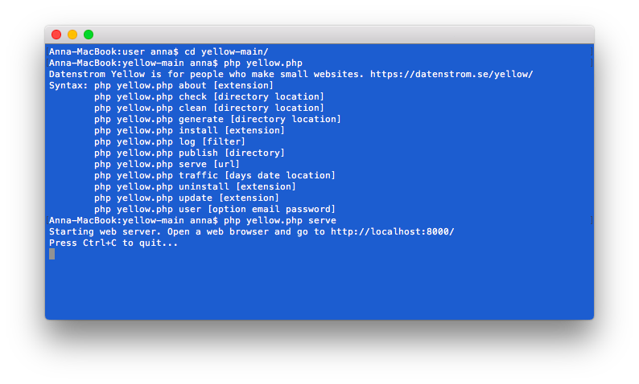

<a href="README-de.md">Deutsch</a> &nbsp; <a href="README.md">English</a> &nbsp; <a href="README-sv.md">Svenska</a>

# Serve 0.8.24

Eingebauter Webserver.

## Wie man eine Erweiterung installiert

[ZIP-Datei herunterladen](https://github.com/annaesvensson/yellow-serve/archive/refs/heads/main.zip) und in dein `system/extensions`-Verzeichnis kopieren. [Weitere Informationen zu Erweiterungen](https://github.com/annaesvensson/yellow-update/tree/main/README-de.md).

## Wie man einen Webserver startet

Du kannst einen Webserver in der [Befehlszeile](https://github.com/annaesvensson/yellow-core/tree/main/README-de.md) starten. Der eingebaute Webserver ist praktisch für Entwickler, Designer und Übersetzer. Das gibt dir die Möglichkeit Webseiten auf deinem Computer anzuzeigen, sie zu überprüfen und später auf den externen Webserver hochzuladen. Öffne ein Terminalfenster. Gehe ins Installations-Verzeichnis, dort wo sich die Datei `yellow.php` befindet. Gib ein `php yellow.php serve`, du kannst wahlweise eine URL angeben. Öffne einen Webbrowser und gehe zur angezeigten URL.

## Beispiele

Webserver in der Befehlszeile starten:

`php yellow.php serve`  

Webserver in der Befehlszeile starten, unterschiedliche URL:

`php yellow.php serve http://localhost:8000/`  
`php yellow.php serve http://localhost:8080/`  
`php yellow.php serve http://localhost:8888/`  

## Entwickler

Anna Svensson. [Hilfe finden](https://datenstrom.se/de/yellow/help/).
